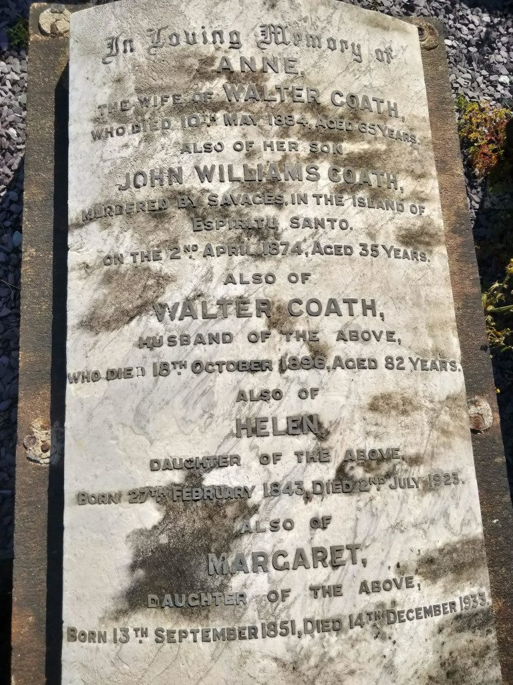

Static Website generator for data on graves
===========================================

Python code to generate a simple static website intended to display information on graves.

During the first pandemic lockdown in 2020 I started exploring [Ford Park Cemetery][1] in Plymouth. This Victorian Cemetery, founded in 1848, contains many interesting monuments. I started making notes on some of them and began to need a way to present the information.

The first grave to make me sit up and take notice was that of 
John Williams Coath. It says on is gravestone that he was "murdered by savages". With a bit of searching I found the whole story had been researched and recorded.

I began to look more closely at the graves. I found many interesting and some tragic stories. The period of the graves covered most of the Victorian era onwards. Plymouth was largest Naval base in Europe at the height of the British Empire. So the graves record the history of empire.

I found managers of slave mines in Brazil, a man killed in a gunpowder magazine explosion in Accra, a tragic story of misunderstanding that resulted in 2 officers being shot dead in Torquay during WWI.

The victims of military hubris that resulted in the loss of the HMS Monmouth at the Battle of Coronel in 1914. The crew of an early submarine that sank with all hands in Plymouth Sound.

There are troops the were killed in Ireland, during the war for independence in 1920/21. So I learned about the events that led up to their deaths.

Plymouth was subject to terrible bombing raids during WWII and many of the victims are buried here.

There are lots of "lost at sea" graves. You would expect this in a maritime city, but the stories touched me. The Titanic, the earlier SS Atlantic, HMS Pathfinder,
HMS Amphion, HMS Rawalpindi, HMS Illustrious.

I wanted a way to record my discoveries.

I am not a web designer and I'm am not particularly proficient in Javascript. But this repository holds my efforts so far.

I still need to import my data into this archive. But I've been very busy with work lately.

The list of sites is stored in the file fpc.csv. This is a simple csv file that has the fields :

    "date","name","title","photo","lon","lat","text","html".

The cemetery uses a reference system to refer to each grave uniquely, but I don't, as yet, have a way to discover this. So I'm using GPS co-ordinates. To capture an entry I photograph it, and make a note of the GPS value. Sometimes I have to hand adjust these, to compensate for errors in the GPS.

The date is the date of death recorded on the grave. The "title" a summary of the grave. "photo" is the filename of the photo. Photos are saved in the directory 'photos'.

"lon" and "lat" are the GPS coordinates in EPSG:4326.

"text" is the filename of a document saved in the directory 'source'.

The python program gen_docs.py is used to convert the input documents into HTML. This is done using
[pandoc](https://pandoc.org/). So you will need that installed on your machine.

The resulting HTML files are saved in 'docs'.

The Makefile has a few simple options. To test the site you can run

    make serve

You can then navigate to
[http://localhost:8080](http://localhost:8080)
to view the generated site locally.

The file 'fpc.json' is created by csv2json.py and contains a 
[JSON](https://www.json.org/json-en.html) file containing all the data needed by the Javascript runtime.

The file 'whereami.js' contains the Javascript run-time used to run the site. I don't claim to be good at Javascript and would welcome improvements to this file.

My experimental site is currently at
[https://www.whatdowewant.co.uk/fpc/index.html](https://www.whatdowewant.co.uk/fpc/index.html)

FIN

[1]: https://www.ford-park-cemetery.org/        "Ford Park Cemetery"