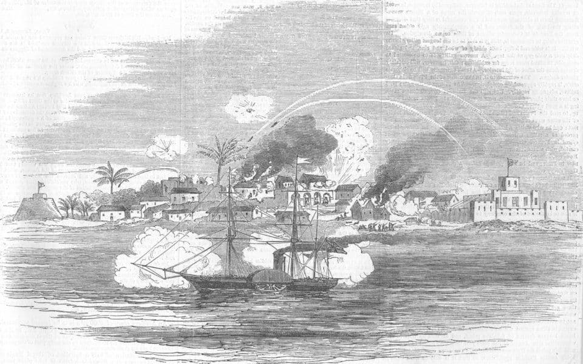

Edward Hill
===========

killed in a powder magazine explosion, Accra 1856.

Sacred to the memory of Edward Hill born January 21st 1800 died October 25th 1865 also Edward Hill Esquire, Lieutenant & Adjutant of the Royal Engineers, eldest beloved son of the above born March 21 1822 who was killed by the explosion of the powder magazine February 24th 1856 at the Christedinsberg Castle, Accra, Coast of Africa, whose high testimony of his gallantry as a zeolous most energetic officer in the execution of every duty one whose death was most deeply deplored.

[wikipedia](https://en.wikipedia.org/wiki/Osu_Castle)

"The area was first occupied in 1550 by the Portuguese, though in the 17th century Portuguese influence diminished. The area came under the control of Sweden in the 1650s, led by the Dutch trader Hendrik Carloff. In 1652, he was given permission to build a small fortified lodge by the King of Accra, with whom he had previously done business. In 1660, control passed to the Netherlands but it was soon lost to Denmark-Norway. "

The castle, now called Osu Castle, was originally built by the Danish in the 1660s. It was used as a base for the export of gold and ivory. Later it became a slaving base. The British bought Denmark's Gold Coast possesions in 1850.

In 1852 the British imposed a poll tax on the locals. In 1854 the steamer HMS Scourge shelled Accra as punishment,

"In 1852 the British instituted a poll tax of 1 shilling per man, woman and child. Labadi, Osu, Teshie and other Ga villages refused to pay and on September 13, 1854 they were bombarded by the British warship the ?HMS Scourge, during the celebration of the annual Homowo Festival."

[Ghanaian Museum](https://twitter.com/ghanaianmuseum/status/1172804968895696898)

