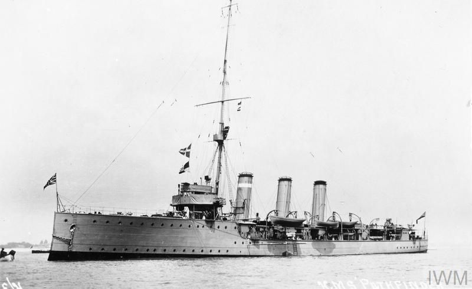

Sydney William Finch
==============
Died on the HMS Pathfinder, sunk on 5 September 1914, 
the first ship to be sunk by a self-propelled torpedo fired by a submarine.

[livesofthefirstworldwar](https://livesofthefirstworldwar.iwm.org.uk/lifestory/6904197)

[wikipedia:HMS Pathfinder](https://en.wikipedia.org/wiki/HMS_Pathfinder_\(1904\))

At 1543 U-21 fired a single 50 cm (20 in) Type G/6 torpedo at a range of 2,000 yards. At 1545 lookouts spotted a torpedo wake heading towards the starboard bow and the officer of the watch, Lieutenant-Commander Favell, attempted to take evasive action by ordering the starboard engine be put astern and the port engine at full ahead while the wheel was turned hard a port, the manoeuvre was not in time and the torpedo struck the ship beneath the bridge. The detonation apparently set off cordite bags in the forward magazine which caused a second, more massive explosion within the fore section of the ship, essentially destroying everything forward of the bridge. Broken in two, the Pathfinder instantly began sinking, dragging most of her crew down with her and leaving a massive pall of smoke to mark her grave. The vessel sank so quickly, in fact, that there was insufficient time to launch lifeboats. (Indeed, the remains of a lifeboat davit and rope can still be seen on the wreck, demonstrating the speed with which the vessel sank.) 

